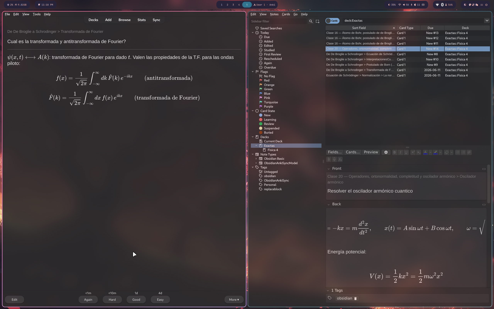
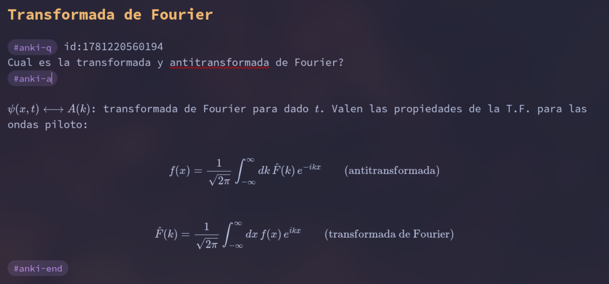

# estudiaF4

Baja las clases de
**[Física 4 (Tamborenea)](https://asignaturas.df.uba.ar/f4-tamborenea/principal/)**
y genera tarjetas de Anki a partir de notas Markdown.

## Idea

**Anki** es un programa de tarjetas (flashcards) que usa **repetición
espaciada**: cada tarjeta tiene una pregunta de un lado y la respuesta del otro,
y según lo bien que la recordás, el algoritmo decide cuándo volver a
mostrártela. Lo que sabés bien aparece cada vez más espaciado y lo que te cuesta
vuelve seguido, así estudiás de forma eficiente y la información pasa a la
memoria de largo plazo. Para una introducción oficial, ver el
[manual de Anki](https://docs.ankiweb.net/background.html).

La idea de este repo es no escribir las tarjetas a mano dentro de Anki, sino
tomar las clases de la materia, pasarlas a notas Markdown y marcar las preguntas
y respuestas con etiquetas simples (`#anki-q … #anki-a … #anki-end`). El script
`anki_export.py` lee esas notas y crea/actualiza automáticamente las tarjetas en
Anki, manteniendo el material de estudio como texto plano versionable y las
tarjetas siempre sincronizadas.



## MUY IMPORTANTE

Los LLMs no son determinísticos, puede haber errores de traducción de imágenes a
MD. No se confíen y verifiquen todo lo que estudian.

## Requisitos

- **Python ≥ 3.10**
- **[uv](https://docs.astral.sh/uv/)**
- **Anki** con el add-on **AnkiConnect**.

## Instalar uv

`uv` es el gestor de paquetes/entornos que corre los scripts (`uv run …`).

- **macOS / Linux**:

  ```bash
  curl -LsSf https://astral.sh/uv/install.sh | sh
  ```

- **Windows** (PowerShell):

  ```powershell
  powershell -ExecutionPolicy ByPass -c "irm https://astral.sh/uv/install.ps1 | iex"
  ```

- **Con package manager**:
  - macOS (Homebrew): `brew install uv`
  - Arch: `sudo pacman -S uv`
  - Cualquier OS (pipx): `pipx install uv`

Más detalles y opciones en la
[documentación oficial](https://docs.astral.sh/uv/getting-started/installation/).

## Instalar Anki

- **macOS / Windows**: descargar desde <https://apps.ankiweb.net/>.
- **Linux**: usar el package manager de la distro, p. ej.
  - Arch: `sudo pacman -S anki`
  - Debian/Ubuntu: `sudo apt install anki`
  - Fedora: `sudo dnf install anki`
  - o el binario oficial / Flatpak (`flatpak install flathub net.ankiweb.Anki`).

## Instalar AnkiConnect

1. Anki → **Herramientas → Complementos → Obtener complementos…**
2. Pegar el código **`2055492159`** y reiniciar Anki.
3. Dejar **Anki abierto** al correr `anki_export.py` (escucha en
   `http://localhost:8765`).

## Crear las tarjetas

Las notas markdown estan en `Resources/Exactas/Fisica 4/`. Y a modo de ejemplo
hay una tarjeta creada al final de la clase 20.

Para crear tus tarjetas:

1. Escribir o convertir la clase a un `.md` dentro de
   `Resources/Exactas/Fisica 4/`.
2. Marcar cada par pregunta/respuesta con los tags #anki-q #anki-a #anki-end:

   ```text
   #anki-q tags:carnot,termo deck:Exactas::Fisica 4
   ¿De qué procesos se compone el ciclo de Carnot?
   #anki-a
   Dos isotérmicos reversibles y dos adiabáticos reversibles.
   #anki-end
   ```

3. (Opcional) Fijar el deck de toda la nota con `anki-deck:` en el frontmatter,
   o por bloque con `deck:Exactas::Fisica 4`. Por defecto el deck se deriva de
   la carpeta.
4. Correr `uv run anki_export.py` con Anki abierto. El script crea las tarjetas
   y escribe un `id:` en cada bloque; al volver a correrlo, esas tarjetas se
   actualizan en lugar de duplicarse.

Dentro de la pregunta y la respuesta podés usar LaTeX (`$inline$`,
`$$display$$`), imágenes (`![[archivo.png]]`), tablas y wikilinks.

Así se ve un bloque dentro de una nota Markdown:



## Sincronizar con anki

Con **Anki abierto** (y AnkiConnect instalado), correr:

```bash
uv run anki_export.py
```

Cada vez que corre escanea las notas, crea las tarjetas nuevas y actualiza las
que ya existen. Para previsualizar sin tocar Anki:

```bash
uv run anki_export.py --dry-run
```

## Eliminar tarjetas

Si eliminas un id de anki en los archivos de markdown el script no elimina la
tarjeta en anki por seguridad. Entonces para eliminar, primero borrar los tags
de anki en los archivos MD y despues eliminar la tarjeta en anki.

Tengan cuidado de eliminar la tarjeta de anki y no elimiar los tags en los
archivos MD porque el script de sync puede fallar.

## Convertir los PDFs a Markdown con un LLM

Las clases vienen en PDF (diapositivas de notas a mano) y hay que pasarlas a
notas Markdown antes de marcar las tarjetas. Este repo ya trae un archivo
[`CLAUDE.md`](CLAUDE.md) con las instrucciones de conversión: qué carpetas usar
(`Clases PDF/` → `Resources/Exactas/Fisica 4/`), respetar los nombres de
archivo, usar LaTeX para las fórmulas y no sobrescribir lo ya convertido.

Con una herramienta de agente que lea ese archivo (p. ej.
[Claude Code](https://claude.com/claude-code), que carga `CLAUDE.md`
automáticamente), basta con pedirle:

```text
Convertí las clases PDF a notas de Markdown siguiendo las instrucciones de CLAUDE.md
```

Si tu herramienta no carga `CLAUDE.md` sola, referencialo explícitamente en el
prompt (en Claude Code con `@CLAUDE.md`):

```text
Convertí las clases PDF a notas de Markdown siguiendo las instrucciones en @CLAUDE.md
```

El agente compara `Clases PDF/` con `Resources/Exactas/Fisica 4/`, lee cada PDF
pendiente como imagen y genera el `.md` correspondiente. Conviene revisar las
fórmulas LaTeX resultantes, ya que el material original son notas a mano.

## Resumen del flujo completo

1. `python bajar_clases.py` → baja los PDFs de las clases.
2. Convertir cada PDF a Markdown (formato con LaTeX para las fórmulas). Yo lo
   hice usando claude con este prompt: "Puedes convertir las clases PDF a notas
   de markdown siguiendo las instrucciones en @CLAUDE.md"
3. Escribir tarjetas dentro de los `.md` con la sintaxis
   `#anki-q … #anki-a … #anki-end`.
4. `uv run anki_export.py` → sincroniza las tarjetas con Anki vía AnkiConnect.

Y el resultado en Anki, con el deck `Exactas::Fisica 4` y las tarjetas
generadas:


## Scripts

### `bajar_clases.py`

```bash
python bajar_clases.py
```

Lee la página de referencia, baja todos los PDFs y saltea los ya descargados. Se
puede correr de nuevo para traer solo las clases nuevas.

### `anki_export.py`

```bash
uv run anki_export.py [rutas...] [--dry-run]
```

Escanea los `.md` (por defecto `Resources/`), extrae los bloques
`#anki-q … #anki-end` y crea/actualiza las tarjetas en Anki. Tras crear una
tarjeta escribe su `id:` en el bloque, así una segunda corrida la actualiza en
vez de duplicarla.

Ejemplo de bloque dentro de una nota:

```text
#anki-q tags:carnot,termo deck:Exactas::Fisica 4
¿De qué procesos se compone el ciclo de Carnot?
#anki-a
Dos isotérmicos reversibles y dos adiabáticos reversibles.
#anki-end
```

Soporta LaTeX (`$inline$`, `$$display$$`), imágenes/audio (`![[archivo]]`),
wikilinks, tablas y más. Ver el docstring del script para el detalle.

## Configuración

Constantes al principio de cada script:

| Script            | Variable                         | Para qué                            |
| ----------------- | -------------------------------- | ----------------------------------- |
| `bajar_clases.py` | `URL`                            | Página de referencia de la materia  |
| `bajar_clases.py` | `DEST`                           | Carpeta donde se guardan los PDFs   |
| `anki_export.py`  | `DEFAULT_SCAN`                   | Carpetas que escanea sin argumentos |
| `anki_export.py`  | `DEFAULT_DECK` / `DEFAULT_MODEL` | Deck y modelo por defecto           |
| `anki_export.py`  | `ANKI_URL`                       | Endpoint de AnkiConnect             |

## Troubleshooting

- **`No pude conectar con AnkiConnect`** → Anki no está abierto o falta el
  add-on `2055492159`. Abrir Anki y verificar el complemento.
- **`No se encontraron PDFs`** → cambió la estructura de la página; revisar
  `URL` en `bajar_clases.py`.
- **`uv: command not found`** → instalar uv:
  `curl -LsSf https://astral.sh/uv/install.sh | sh`.
- **Tarjetas duplicadas** → no borrar la línea `id:…` que el script agrega al
  bloque; es lo que evita el duplicado al re-sincronizar.
- **`media no encontrada`** → la imagen/audio referenciada no existe en el
  vault; revisar el nombre o la ruta.

## Bonus

Las notas en Markdown no sirven solo para Anki. Como son texto plano con enlaces
`[[wikilink]]`, programas de _personal knowledge management_ como
[Obsidian](https://obsidian.md/) las leen directamente y arman un **grafo** de
relaciones entre notas, donde cada archivo es un nodo y cada wikilink una
arista. Eso ayuda a descubrir conexiones entre temas que de otra forma pasarían
desapercibidas.

Es un flujo muy usado en investigación: combinado con gestores de bibliografía
como [Zotero](https://www.zotero.org/) (y plugins como
[Zotero Integration](https://github.com/mgmeyers/obsidian-zotero-integration)),
permite tomar notas enlazadas a las referencias y redactar papers desde ahí.

Además, al ser texto plano, estas mismas notas funcionan muy bien como
**contexto para LLMs** (RAG, bases de conocimiento, etc.): son fáciles de
versionar, indexar y pasar como entrada a un modelo.

## Créditos

El material de las clases es obra del profesor **Pablo Tamborenea**, de la
materia **Física 4** de la FCEN (UBA). Sitio de la materia:
<https://asignaturas.df.uba.ar/f4-tamborenea/principal/>.

Este repo solo organiza ese material para estudiar con Anki; todo el contenido
PDF de las clases pertenece a su autor.

## Licencia

El código de este proyecto se distribuye bajo licencia **MIT** (ver
[`LICENSE`](LICENSE)). La licencia cubre los scripts y herramientas del repo, no
el material PDF de las clases, cuyos derechos pertenecen a Pablo Tamborenea.
